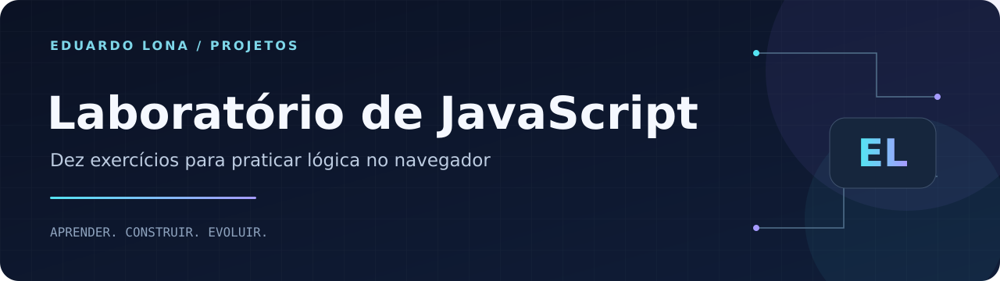

<strong>HTML · CSS · JavaScript · Fundamentos</strong>

<a href="#sobre">Sobre</a> · <a href="#como-executar">Como executar</a> · <a href="https://github.com/Dudulonabr">Perfil do autor</a>

# Exercícios de Lógica com JavaScript

Coleção de exercícios desenvolvidos para praticar **lógica de programação** utilizando HTML, CSS e JavaScript no navegador.

> O nome original do repositório foi mantido, mas a implementação atual utiliza JavaScript.

## Sobre

Exercícios de estudo que conectam lógica de programação e interação no navegador.

## Exercícios

1. Saudação personalizada
2. Verificação de maioridade
3. Par ou ímpar
4. Conversão de temperatura
5. Soma de números
6. Média de notas
7. Números pares
8. Tabuada
9. Array de nomes
10. Objeto de pessoa

## Tecnologias

- HTML5
- CSS3
- JavaScript

## Conceitos praticados

- Variáveis
- Entrada de dados
- Conversão de tipos
- Condicionais
- Operações matemáticas
- Estruturas de repetição
- Arrays
- Objetos
- Manipulação básica do DOM

## Organização

| Caminho | Conteúdo |
| --- | --- |
| `index.html` | Menu dos exercícios |
| `ex1.html` a `ex10.html` | Atividades individuais |
| `1.css` | Estilos das páginas |

## Como executar

Abra o arquivo `index.html` no navegador e escolha um dos exercícios disponíveis.

## Objetivo

Este repositório registra exercícios de estudo e a evolução dos fundamentos de programação aplicados ao desenvolvimento web.

## Créditos

A página original identifica **Eduardo e Mariana** como autores da atividade.

## Autor

**Eduardo Moreira Monteiro Lona** · São Paulo, Brasil

Estudante de **Análise e Desenvolvimento de Sistemas (UNIP)** e **Engenharia de Software (Cruzeiro do Sul)**, com formação técnica em **Informática pelo SENAC**.

[LinkedIn](https://www.linkedin.com/in/eduardo-moreira-monteiro-lona) · [E-mail](mailto:dudulona07@gmail.com) · [GitHub](https://github.com/Dudulonabr)
